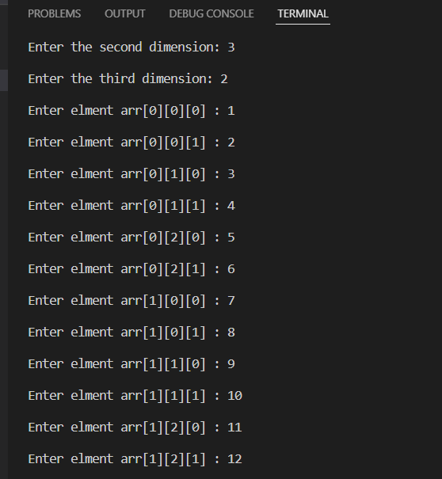
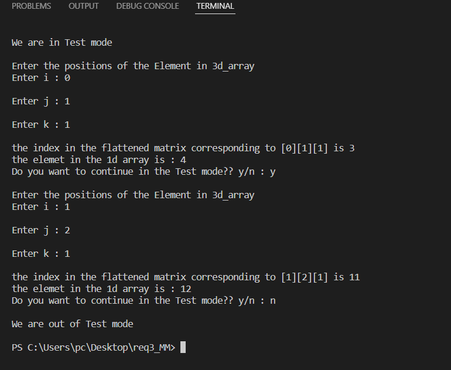

# MasterMicro_Task3

## 📙About
A very simple program for an algorithm to flatten a 3d matrix into 1d 
array and get the index of any element int the 1d array using the 
position (i, j, k) in the 3d matrix.
## 🏁Getting Started
- You only need IDE to run this code like Vscode.
- Install Visual Studio Code.
- Install C++ extension and g++ compiler.
- Run a.exe.
## 💻Built Using
- C++
## 📷Screenshots
### Initializing 3d matrix

### Testing 

